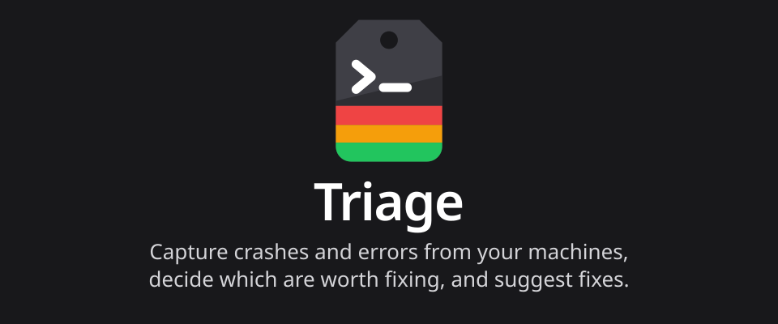

# Triage

Capture crashes and errors from your machines, decide which are worth fixing, and suggest fixes.

`triage` reads the systemd journal on each of your machines, picks out crashes, failed units, out-of-memory kills and errors, redacts them and groups them into issues on one server. A decision model can tell you which issues are worth fixing, and a language model can suggest how. Every part runs wherever you like, with whichever models you like, local or hosted, and AI only runs when you turn it on.

See the [documentation](https://triage.timmo.dev) to install, set up and use it.

The web UI comes in 10 [languages](https://triage.timmo.dev/languages/). The translations are AI-generated, and translators are very welcome.

## Packages

| Package | What it's for |
| --- | --- |
| [`@timmo001/effect-triage-client`](packages/client) | Effect client for a triage server's HTTP API |
| [`@timmo001/effect-triage`](packages/effect-triage) | The event, issue and API schemas every part of triage shares |

## Licence

Apache 2.0. See [LICENSE](LICENSE).
